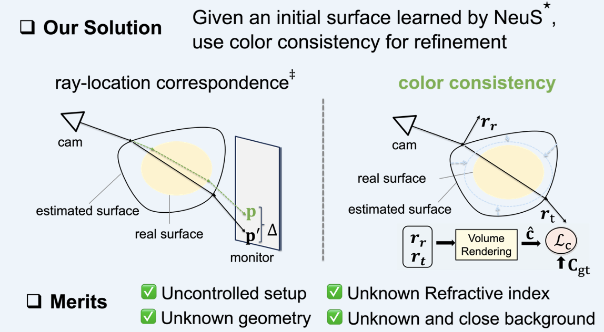
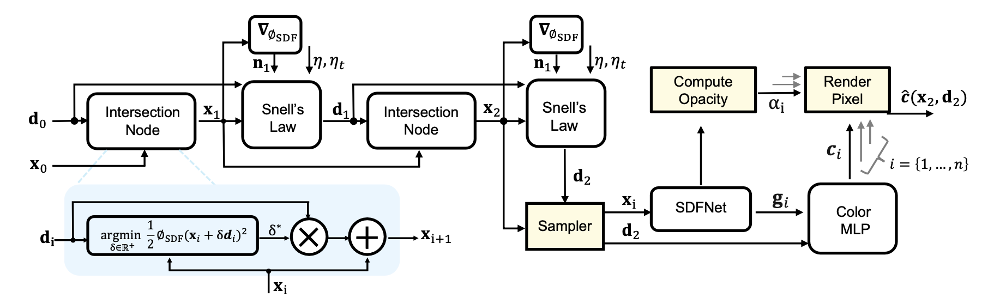
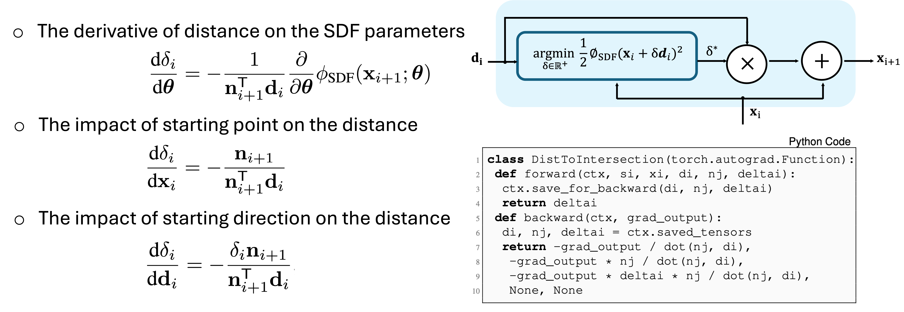

# Differentiable Neural Surface Refinement for Transparent Objects
## [[Paper]](https://openaccess.thecvf.com/content/CVPR2024/papers/Deng_Differentiable_Neural_Surface_Refinement_for_Modeling_Transparent_Objects_CVPR_2024_paper.pdf) [[CVPR'24 Project]](https://tnsr.rios.ai)


### PyTorch Implementation of Transparent Neural Surface Refinement (TNSR)
(TNSR follows the integration guidelines described [here](https://docs.nerf.studio/developer_guides/new_methods.html) for custom methods within Nerfstudio)

### Prerequisites

- Linux (tested on Ubuntu 20.04.1 LTS)
- NVIDIA GPU + CUDA CuDNN (tested on RTX 3080 Ti)
- Please use PyTorch2.0.1 to avoid compilation errors (other versions should be good). You might need to change the file paths, and please be sure you change the corresponding paths in the codes as well

### Installation
0. Install Nerfstudio dependencies
    - Please refer to the instruction of [nerfstudio](https://docs.nerf.studio/quickstart/installation.html)
    - <details>
      <summary>Here are our scripts for your reference</summary>
      
      ```bash
      # python environment
      conda create --name tnsr -y python=3.8
      conda activate tnsr
      python -m pip install --upgrade pip
      
      # dependencies
      conda install pytorch==2.0.1 torchvision==0.15.2 torchaudio==2.0.2 pytorch-cuda=11.7 -c pytorch -c nvidia
      conda install -c conda-forge cudatoolkit-dev
      pip install torchtyping
      pip install ninja git+https://github.com/NVlabs/tiny-cuda-nn/#subdirectory=bindings/torch
      pip install git+https://github.com/nerfstudio-project/nerfacc.git
      
      # From pip: install nerfstudio
      pip install nerfstudio
      
      #-------------------------------------Optional-------------------------------------#
      # pip install gsplat==0.1.11
      # From source Optional, use this command if you want the latest development version.
      git clone https://github.com/nerfstudio-project/nerfstudio.git
      cd nerfstudio
      pip install --upgrade pip setuptools
      # Name: setuptools Version: 68.0.0
      pip install -e .
      #-------------------------------------Optional-------------------------------------#
      ```
    
  - Notes: If using <b>ns-viewer</b>, please check the documents in [ns-viewer](https://docs.nerf.studio/developer_guides/viewer/index.html).
ns-viewer is helpful in defining the cuboid below.

1. Clone this repo

   ```
   git clone https://github.com/rios/TNSR.git
   ```

2. Install this repo as a python package

    - Navigate to this folder and run `python -m pip install -e .`

3. Run 

    ```
    ns-install-cli
    ```

4. Checking the install

    Run `ns-train -h`: you should see `tnsr-initia` and `tnsr-refine` included among them.

### Getting started

0. Data preparation
   - Download the data [here](https://drive.google.com/drive/folders/1uu89pBurNHBLkBQaRsEEYR0WDWF2OGEY?usp=share_link)
   - Blender data (Synthetic data): using `blender-data` as data parser
   - Real-world data: using `nerfstudio-data` as dataparser

1. The scripts are provided in `./scrips`. Please check the following script for blender data of `waterball`

   - Step 1: learn an initial surface with NeuS
      <details>
      <summary>Here are our scripts for your reference:</summary>
   
      ```bash
      # The hyper-parameters are from [sdfstudio](https://github.com/autonomousvision/sdfstudio)
      ns-train tnsr-initial \
          --project-name nsr-waterball \
          --experiment-name nsr-waterball-intial \
          --pipeline.model.sdf-field.use-grid-feature True \
          --pipeline.model.sdf-field.hidden-dim 256 \
          --pipeline.model.sdf-field.num-layers 2 \
          --pipeline.model.sdf-field.num-layers-color 2 \
          --pipeline.model.sdf-field.use-appearance-embedding False \
          --pipeline.model.sdf-field.geometric-init True \
          --pipeline.model.sdf-field.inside-outside False \
          --pipeline.model.sdf-field.bias 0.5 \
          --pipeline.model.sdf-field.beta-init 0.3 \
          --pipeline.model.near-plane 0.2 \
          --pipeline.model.far-plane 10 \
          --pipeline.model.overwrite_near_far-plane True \
          --pipeline.model.smooth_loss_multi 0.05 \
          --pipeline.model.background-model none \
          --pipeline.datamanager.train-num-rays-per-batch 2048 \
          --vis wandb \
          --data /YOURPATH/waterball blender-data \
          --scale_factor 0.1
          # Note: wandb is optional
   
   - Step 2: learn an initial surface with NeuS
      <details>
      <summary>Please specify the weight path for the step 1: ```--load-checkpoint```</summary>
   
      ```bash
      ns-train tnsr-refine \
          --load-checkpoint ./outputs/nsr-waterball-intial/nsr-intial/YOURPATH/nerfstudio_models/step-000040000.ckpt \
          --project-name nsr-waterball \
          --experiment-name nsr-waterball-refine \
          --pipeline.model.sdf-field.use-grid-feature True \
          --pipeline.model.sdf-field.hidden-dim 256 \
          --pipeline.model.sdf-field.num-layers 2 \
          --pipeline.model.sdf-field.num-layers-color 2 \
          --pipeline.model.sdf-field.use-appearance-embedding False \
          --pipeline.model.sdf-field.geometric-init True \
          --pipeline.model.sdf-field.inside-outside False \
          --pipeline.model.sdf-field.bias 0.5 \
          --pipeline.model.sdf-field.beta-init 0.3 \
          --pipeline.model.near-plane 0.2 \
          --pipeline.model.far-plane 10 \
          --pipeline.model.overwrite_near_far_plane True \
          --pipeline.model.smooth_loss_multi 0.02 \
          --pipeline.model.background-model none \
          --pipeline.model.refinement True \
          --pipeline.model.cuboid_coordinates -0.15 -0.15 -0.15 0.15 0.15 0.15 \
          --pipeline.model.eta 1.45 \
          --pipeline.datamanager.train-num-rays-per-batch 2048 \
          --vis wandb \
          --data /YOURPATH/waterball blender-data \
          --scale_factor 0.1 
          # wandb is optional
     
### Nerfstudio Add-on Version

- [x] Release source codes based nerfstudio
- [x] TNSR follows the integration guidelines described [here](https://docs.nerf.studio/developer_guides/new_methods.html) for custom methods within Nerfstudio
 
### Method     


We present Transparent Neural Surface Refinement (TNSR), which reconstructs transparent surfaces using only color consistency from multi-view RGB images,
significantly improving geometry estimation and view synthesis.


   
### Bibtex
If you find this useful, please cite the paper!
<pre id="codecell0">@inproceedings{Deng:CVPR2024,
  author    = {Weijian Deng and
               Dylan Campbell and
               Chunyi Sun and
               Shubham Kanitkar and
               Matthew Shaffer and
               Stephen Gould},
  title     = {Differentiable Neural Surface Refinement for Transparent Objects},
  booktitle = {CVPR},
  year      = {2024}
} </pre>

<pre id="codecell0">@article{Gould:PAMI2021,
  author    = {Stephen Gould and
               Richard Hartley and
               Dylan Campbell},
  title     = {Deep Declarative Networks},
  journal   = {PAMI},
  year      = {2021},
  doi       = {10.1109/TPAMI.2021.3059462}
} </pre>


<pre id="codecell0">@inproceedings{nerfstudio,
	title        = {Nerfstudio: A Modular Framework for Neural Radiance Field Development},
	author       = {
		Tancik, Matthew and Weber, Ethan and Ng, Evonne and Li, Ruilong and Yi, Brent
		and Kerr, Justin and Wang, Terrance and Kristoffersen, Alexander and Austin,
		Jake and Salahi, Kamyar and Ahuja, Abhik and McAllister, David and Kanazawa,
		Angjoo
	},
	year         = 2023,
	booktitle    = {ACM SIGGRAPH 2023 Conference Proceedings},
	series       = {SIGGRAPH '23}
}</pre>

<pre id="codecell0">@article{wang2021neus,
  title={NeuS: Learning Neural Implicit Surfaces by Volume Rendering for Multi-view Reconstruction},
  author={Wang, Peng and Liu, Lingjie and Liu, Yuan and Theobalt, Christian and Komura, Taku and Wang, Wenping},
  journal={Advances in Neural Information Processing Systems},
  volume={34},
  pages={27171--27183},
  year={2021}
}</pre>

<pre id="codecell0">@inproceedings{DVR,
    title = {Differentiable Volumetric Rendering: Learning Implicit 3D Representations without 3D Supervision},
    author = {Niemeyer, Michael and Mescheder, Lars and Oechsle, Michael and Geiger, Andreas},
    booktitle = {Proc. IEEE Conf. on Computer Vision and Pattern Recognition (CVPR)},
    year = {2020}
}</pre>

### License
MIT
